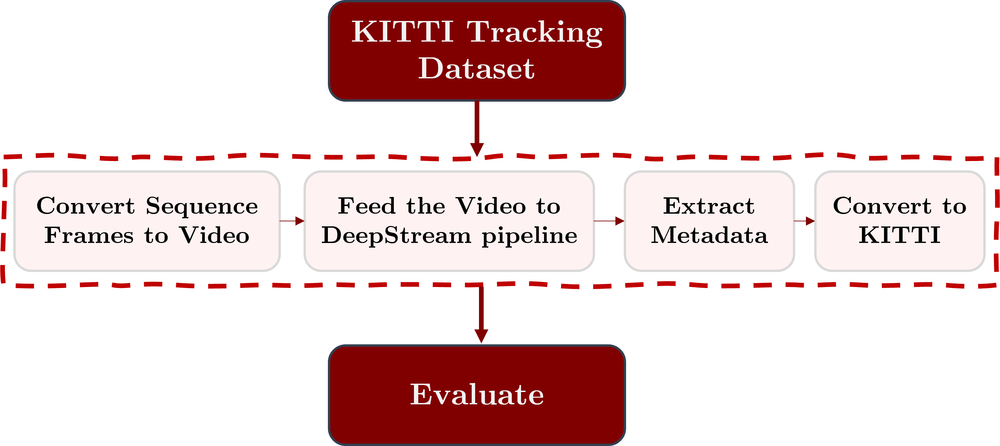
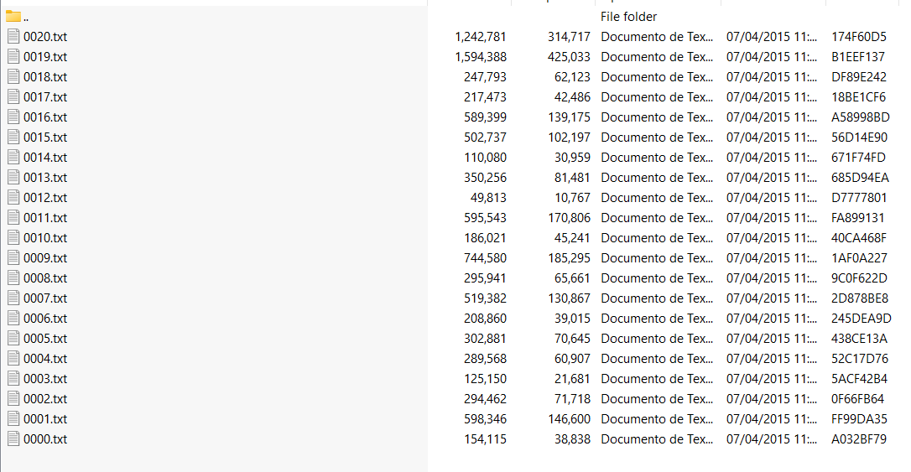

# DeepStream Tracker Eval on KITTI 
This repository is a guide to evaluate DeepStream trackers on the popular KITTI dataset.
It follows this methodology:




Created: June 3, 2022 2:30 PM

# Step 1: Download KITTI Data

To evaluate on the kitti dataset first we need to download it.

You can find the files here:

[http://www.cvlibs.net/datasets/kitti/eval_tracking.php](http://www.cvlibs.net/datasets/kitti/eval_tracking.php)

Download left camera images (15GB) and the labels (9MB)

The labels will contain .txt Files for every Kitti Evaluation Sequence



The images will contain a similar folder structure for each sequence


Inside each of these sequence folders there are the image frames.


# Step Two - Generate Video Data for DeepStream

Since DeepStream takes video as input we need to convert these frames to video format.

The Kitti Evaluation set is recorded at 10 FPS. So we need to create a video sequence from these frames. We can do so by utilizing FFMPEG.

Inside each of the subsequence image frame folders run:

```bash
ffmpeg -framerate 10 -i %6d.jpg 0007.mp4
```

Since the kitti files have 6 digits we insert %6d.  Change the 0007.mp4 to the desired file name

This will generate an mp4 file we can use to run on DeepStream

The instructions on how to run DeepStream with YOLO and get the tracker output are refferenced on the following:

[https://github.com/callmesora/DeepStream-YOLO-DeepSORT#implement-tracking](https://github.com/callmesora/DeepStream-YOLO-DeepSORT#implement-tracking)

It is important to define in the deepstream_app-config.txt a folder for the tracker-kitti-output

As an example

```bash
[application]
enable-perf-measurement=1
perf-measurement-interval-sec=5
kitti-track-output-dir=/home/Tracker_Info
```

Another important thing to keep in mind is to define configurations for evaluation. DeepStream utilizes tiled display when rendering the images. It’s important to turn it off when saving this data. The resolution of the output tracker configs will have the same resolution as the [STREAMUX] plugin once the tiled display is off. 

This resolution **needs to be the same** as the input video resolution. In the case of KITTI Ground Truth Data **1242x375**

After the config is done and the DeepStream app is run, the output folder will have a similar structure to this:


# Step 3 - Transform the Data to KITTI Evaluation Format

Next step is to git clone this repo

```bash
git clone https://github.com/callmesora/DeepStream-TrackerEval.git
```

Create a folder with the name kitty_track and insert the .txt labels outputed by DeepStream

```bash
cd DeepStream-TrackEval
mkdir kitty_track
mkdir frames
```

Move all the .txt files inside kitty_track

Move all the .png files inside frames 

Run the Script:

```bash
python3 file_formater_DS_to_KITTI.py -file kitti_track -images frames/
```

- -file flag is the folder with the .txt labels
- -images flag is the folder with the image frames

The kitti format outputed by DeepStream is of the type

“Car 0 0.0 0 0.0 0.335112 264.069275 205.788223 375.712494 0.0 0.0 0.0 0.0 0.0 0.0 0.0 1.000000”

We want the frame label to be inserted before as such:

“0001 Car 0 0.0 0 0.0 0.335112 264.069275 205.788223 375.712494 0.0 0.0 0.0 0.0 0.0 0.0 0.0 1.000000”

 the object type so an intermediate file is created 

concatenating all the sequence frames together called **KITTI_CUMMULATED.txt**

The Kitti evaluation format is slightly different, having two swapped labels.

---

**DeepStream Kitti Format**

["frame_id","type","tracker_id", "truncated", "occluded", "alpha", "bbox1","bbox2","bbox3","bbox4", "dimensions1","dimensions2","dimensions3", "location1","location2","location3","rotation_y","score"]

**KITTI Evaluation Format**

[["frame_id","tracker_id","type", "truncated", "occluded", "alpha", "bbox1","bbox2","bbox3","bbox4", "dimensions1","dimensions2","dimensions3", "location1","location2","location3","rotation_y","score"]]

So the File **KITTI-Culmulated-Formated.txt** is created

This file can be used in the official TrackerEvaluation algorithm.

# Step 4 - Evaluate the Tracker

First we need the official TrackerEvaluation SDK

[https://github.com/JonathonLuiten/TrackEval](https://github.com/JonathonLuiten/TrackEval)

```bash
git clone https://github.com/JonathonLuiten/TrackEval.git
```

The instructions to run each of the scripts can be found in that repository. 

Delete the gt data found in TrackEval\data\gt\kitti\kitti_2d_box_train\label_02

### First: Download the data.zip

For a quick set up the TrackEval Demo files can be used. (150MB)

[https://omnomnom.vision.rwth-aachen.de/data/TrackEval/data.zip](https://omnomnom.vision.rwth-aachen.de/data/TrackEval/data.zip)

The easiest way to begin is to extract this zip into the repository root folder such that the file paths look like: TrackEval/data/gt/…

Of course, if your ground-truth and tracker files are located somewhere else you can simply use the script arguments to point the code toward your data.

### Second: Change the data in gt  with the kitti data

Delete the gt data found in TrackEval\data\gt\kitti\kitti_2d_box_train\label_02

Exchange it with the 00000.txt file you downloaded from the KITTI website before. 

Now we have to change the sequence training mapping file.

The evaluate_tracking.seqmap.training file should look like this:

```bash
0000 empty 000000 000800
```

Where 0000 is the sequence , 00000 is the starting image and 000800 is the last image in the sequence.

Expand this file if you have multiple sequences or different number of images.

### Third: Change the data in the trackers folder

Delete and change the data in TrackEval\data\trackers\kitti\kitti_2d_box_train\CIWT\data with the ***KITTI_CUMMULATED_FORMATED**.txt file created before. Remember to change its name to the sequence accordingly to the ground truth data. Example 0000.txt

### Finnaly Run the run_kitty.py script

Since we swapped all the labels in the original folders we don’t need to provide any aditional arguments. 

```bash
python3 scripts/run_kitty.py
```


Bellow is the configurations used to extract the data
```bash
[application]
enable-perf-measurement=1
perf-measurement-interval-sec=5
kitti-track-output-dir=/xavier_ssd/Tracker_Info
#gie-kitti-output-dir=/xavier_ssd/Tracker_Info

[tiled-display]
enable=0
rows=1
columns=1
width=1280
height=720
gpu-id=0
nvbuf-memory-type=0

[source0]
enable=1
type=3
#uri=file:///opt/nvidia/deepstream/deepstream/samples/streams/sample_1080p_h264.mp4
#uri=file:///opt/nvidia/deepstream/deepstream/samples/streams/sample_qHD_short.mp4
uri=file:///opt/nvidia/deepstream/deepstream/samples/streams/kitti-gt2.mp4
num-sources=1
gpu-id=0
cudadec-memtype=0

[sink0]
enable=1
type=2
sync=0
gpu-id=0
nvbuf-memory-type=0

[sink1]
enable=1
type=3
container=1
sync=0
codec=1
bitrate=2000000
output-file=out-kitti.mp4

[osd]
enable=0
gpu-id=0
border-width=5
text-size=15
text-color=1;1;1;1;
text-bg-color=0.3;0.3;0.3;1
font=Serif
show-clock=0
clock-x-offset=800
clock-y-offset=820
clock-text-size=12
clock-color=1;0;0;0
nvbuf-memory-type=0

[streammux]
gpu-id=0
live-source=0
batch-size=1
batched-push-timeout=40000
width=1242
height=374
enable-padding=0
nvbuf-memory-type=0

[primary-gie]
enable=1
gpu-id=0
gie-unique-id=1
nvbuf-memory-type=0
interval=0
config-file=config_infer_primary_yolor.txt

[tracker]
enable=1
tracker-width=640
tracker-height=640
gpu-id=0
ll-lib-file=/opt/nvidia/deepstream/deepstream/lib/libnvds_nvmultiobjecttracker.so
#ll-lib-file=/opt/nvidia/deepstream/deepstream/lib/libByteTracker.so

#-Tracker Config
ll-config-file=/opt/nvidia/deepstream/deepstream/samples/configs/deepstream-app/config_tracker_DeepSORT.yml
#ll-config-file=/opt/nvidia/deepstream/deepstream/samples/configs/deepstream-app/config_tracker_NvDCF_accuracy.yml
#ll-config-file=/opt/nvidia/deepstream/deepstream/samples/configs/deepstream-app/config_tracker_IOU.yml

#enable-past-frame=1
enable-batch-process=1

[tests]
file-loop=0
```
